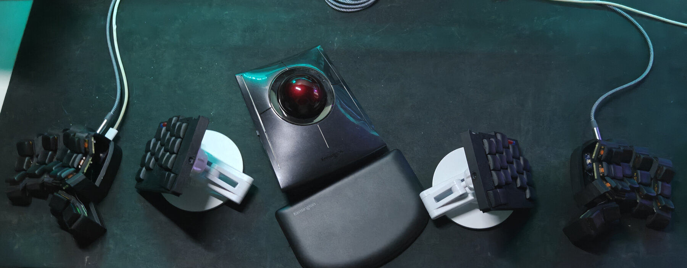
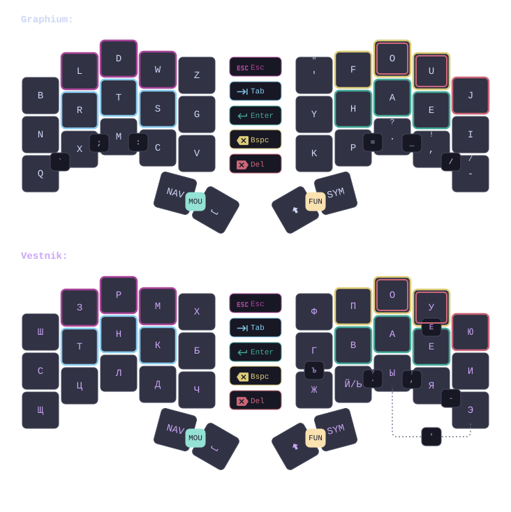

# keebs

This is the keymap I use on all my keyboards. The same config generates both ZMK and QMK firmware.
My current 34-key setup can be seen below.





[Click for full 34-key keymap](draw/generated/cradio_34.svg)

## Keymap

### Alpha layouts

**Graphium** started as [Graphite's](https://github.com/rdavison/graphite-layout) left hand paired with [Gallium's](https://github.com/GalileoBlues/Gallium) right hand. It has since moved closer to Graphite, with punctuation rearranged onto stronger fingers.

**Vestnik** is my Russian-first Cyrillic layout. It combines `Й` and `Ь` into one contextual key: it emits `Й` normally and `Ь` after a consonant. This fits the useful Russian alphabet onto a 3×5 matrix without hiding common letters behind combos or layers. The same physical layer can drive a Ukrainian host layout, but its direct-key choices are not optimized for Ukrainian yet.

Both layouts use [adaptive swaps](https://dario.ca/posts/2026-05-18-keyboard-layout-adaptive-swaps/) to remove selected [same-finger bigrams](https://layouts.wiki/reference/metrics/same-finger/#same-finger-bigram). After a trigger key, two other keys temporarily exchange outputs. For example, after `s`, the physical `d` key emits `c`, turning `sc` into a roll; the rarer `sd` is typed through the other side of the swap. I also use this mechanism to repair selected [weak redirects](https://layouts.wiki/reference/metrics/rhythm/#weak-redirects), extending the idea from bigrams to awkward trigram patterns. This application is my own addition. The rules take some learning, but common sequences become much more comfortable.

### Thumbs and layers

The 34-key profile has three thumb setups:

- `right_space_split`: Sym, Backspace/Nav, Space, Num.
- `left_space_split`: Nav, Space, a configurable opposite thumb, Sym; holding Nav and Sym opens Num.
- `left_space_combined`: Nav, Space, a configurable opposite thumb, SymNum.

The homing thumb opposite Space can be Backspace, Shift, or Repeat without changing the rest of the setup. I currently use `left_space_split` with Shift.

Both left thumbs open Mouse; both right thumbs open Fn. Layers follow the thumbs still held, so adding or releasing one falls directly into the resulting layer without resetting the chord.

### Layer-mod chords

The main highlight of this keymap is its modifier system. It combines the held behavior of home-row mods with the sticky behavior of [Callum's original oneshot mods](https://github.com/callum-oakley/qmk_firmware/tree/master/users/callum).

Callum's later [half-layer write-up](https://github.com/callum-oakley/keymap#design) explains the basic tradeoff: mod-taps are timing-sensitive, while oneshot mods split a chord into separate motions and must be reactivated for repeated shortcuts. [Timeless HRMs](https://github.com/urob/zmk-config#timeless-homerow-mods) avoid most misfires, but still rely on prior-idle handling and can force the modifier hand when its key overlaps the shortcut letter.

My [`layer_mod_chord`](config/modules/layer-chord/) behavior combines both models. I can hold the layer first or chord it with a modifier. Once active, the modifier behaves normally while held. Releasing it unused makes it sticky for the next key; releasing only the layer returns to the base layer while the modifier stays held. This works for repeated shortcuts, mouse modifiers, and consecutive shifted letters. Modifiers stack, either hand can supply them, and the layer or modifier key may land first.

There is no prior-idle check or tap-versus-hold decision. The eight modifier positions participate in 40 ms combos, which recognize either press order without a noticeable delay in normal typing. The 175 ms cutoff only decides whether a quickly released, unused modifier should become sticky; it does not delay held activation. The same state machine is implemented in ZMK and QMK. Timeless home-row mods remain available for the 30-key profile.

## Declarative keymap

The source of truth lives in [`keymap/`](keymap/):

- [`layers.toml`](keymap/layers.toml) defines layers and thumb arrangements.
- [`behaviors.toml`](keymap/behaviors.toml) defines behaviors, adaptives, combos, and timings.
- [`keymap.toml`](keymap/keymap.toml) selects the setup, features, layer stacks, and OS mappings.
- [`profiles.json`](keymap/profiles.json) maps the logical core onto physical boards and firmware targets.

[`scripts/keymap.py`](scripts/keymap.py) generates ZMK devicetree, QMK C, manifests, and [keymap-drawer](https://github.com/caksoylar/keymap-drawer) input. Board-specific files remain under [`config/keyboards/`](config/keyboards/) and [`qmk/keyboards/`](qmk/keyboards/).

## Build

The Nix shell currently targets x86-64 Linux.

```sh
nix develop
just targets
just setup klotz
just build klotz
just setup dartyl qmk
just build dartyl qmk
just reset klotz
just draw all
just check
```

`just targets` lists the available boards and backends. `just check` validates the model, generated firmware, manifests, scripts, and drawings.
