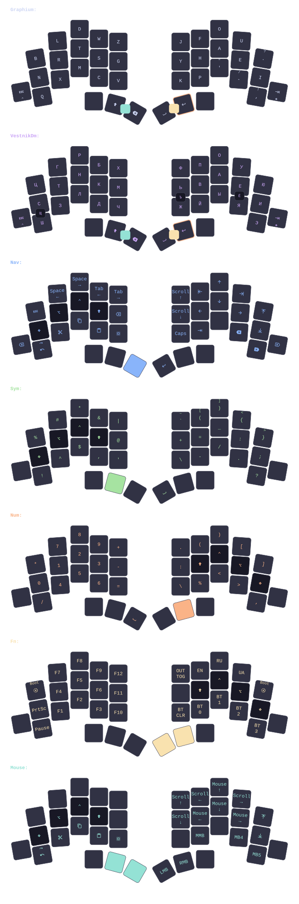
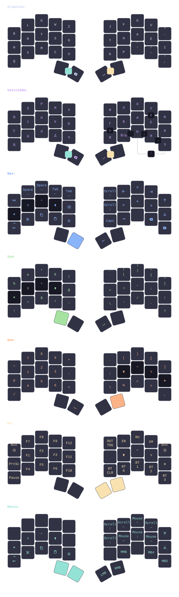
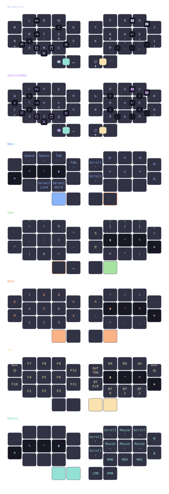

# keebs

Personal Graphium and Vestnik keymap compiled from one semantic model to ZMK, QMK, and keymap-drawer.

## Current layout



Other sizes: [34-key](draw/generated/cradio_34.svg) · [30-key](draw/generated/luna_30.svg)

<details>
<summary>34-key layout</summary>



</details>

<details>
<summary>30-key layout</summary>



</details>

## Configuration

- `keymap/layers.toml`: keys and layers
- `keymap/behaviors.toml`: timings, combos, and behaviors
- `keymap/keymap.toml`: layer order and OS actions
- `keymap/profiles.json`: authoritative target, board, shield, and physical-layout registry

Run local checks and inspect supported/default backends in the pinned Nix shell:

```sh
nix develop -c just check
nix develop -c just targets
```

Firmware setup and compilation require Zephyr SDK 0.17.0:

```sh
nix develop -c just setup luna
nix develop -c just build luna
nix develop -c just build aurora wired
```

`just` lists every command. Generated keymap sources live under `.cache/keymap/`; firmware builds live under `build/`; drawings live under `draw/generated/`. Firmware output is not committed or proof of flashing. Manifests pin every west project to a full commit SHA; `scripts/check` rejects floating revisions.
